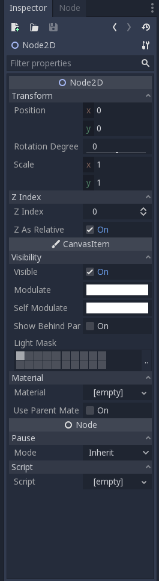
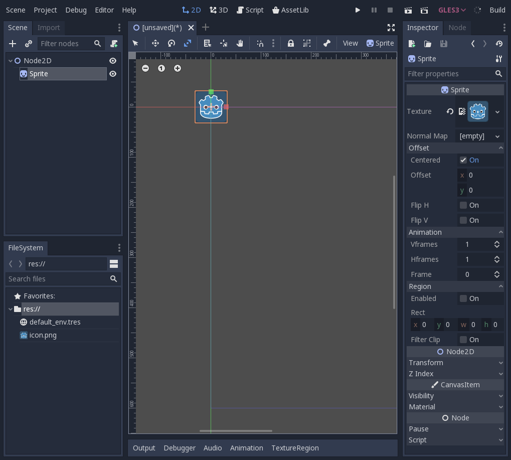

.. _godot_basics:

Godot Basics
===================

A lot of this section is going to be just linking to the official Godot
documentation for information. Be sure to read the Godot documentation provided.
Future sections will not be this link heavy.

The Godot interface
-------------------

When you first start using Godot, it is important to learn how to navigate
Godot's interface. Godot's official documentation has a good primer on this:
`Introduction to Godot's Editor`_.

Scenes and Nodes
----------------

One of the most important concepts in Godot is the concept of scenes and nodes.
A node is a single 'object' in a game, and can represent any number of things:
a player, an enemy, etc. Nodes are arranged such that one node can contain any
number of other nodes under it (its children), but a node can only belong to one
other node (its parent). A scene is a collection of nodes and their properties,
that can later be added to (instanced to) another scene. You can read about
scenes and nodes here: `Scenes and Nodes`_.

Instancing a scene just loads a scene from a different file (.scn or .tscn),
and adds the root node as a child of an already existing node. You can read
more about instancing here: `Instancing`_, `Instancing (continued)`_,
`Godot's Design Philosophy`_, and `SceneTree`_.

Types of Nodes
--------------

There are many different types of nodes within Godot with a variety of different
uses and functionalities. Node types are arranged in a hierarchy, where some
nodes extend the functionality of other nodes. For example, Sprite nodes extend
Node2D, since Sprite has a 2D position.

One type of node is the Control nodes. Control nodes are used for designing
rich UIs and interfaces. The Godot documentation has an article on how to use
Control nodes here: `Design Interfaces With the Control Nodes`_,
`Design a Title Screen`_, and `Design the GUI`_.

Another type of node is Node2D. Node2D nodes have a 2D transform that consists
of a 2D position, an angular rotation, and a 2D scale (stretches width and
height). You can see all of the properties of a Node2D below. Note that a
Node2D can also have it's CanvasItem properties configured, as Node2D inherits
CanvasItem.

Both Node2D and Control nodes are CanvasItems. CanvasItems represent anything
that can be drawn to the screen. Not all CanvasItems have graphics associated
with them.

The Sprite node is a node that has a texture and is drawn to the screen. Sprites
are often used for displaying game objects, such as a player or enemy's body, or
a coin's image.

Another important type of Node is Spatial nodes, which have a 3D transform,
some of which can draw 3D graphics.

2D Physics Nodes
----------------

For 2D physics, there are CollisionObject2D nodes, which are nodes that have a
given shape and can detect other CollisionObject2D nodes that touch them.
Another type of node that inherits it is PhysicsBody2D, which are nodes that
act as physical objects in the game world. These nodes need to have one or more
CollisionShape2D nodes as children, otherwise they will have no shape associated
with them. Read Godot's `Physics Introduction`_ to learn more about physics
objects.

If you find the idea of layers and masks confusing, think of them like this:
'layers' are the what the object is. If an object is solid, such as a wall,
floor, ceiling, a rock, etc., it will have the solid layer set. 'mask' is what
the object collides with. A player object is not a solid object

One of the most important 2D physics nodes is KinematicBody2D. KinematicBody2D
is just a node that represents a physical object that can be controlled through
code, and is commonly used for physical objects like players, enemies, etc.

Resources
---------

Not everything in Godot is a Node, some data is held in objects called
Resources. A resource is an object that can be shared between many nodes. For
example, an image can be shared between multiple different Sprite nodes.
Textures, audio, collision shapes, videos, scripts, etc. are all resources.
You can read more about them here: `Resources`_, only read up to and including
the section titled 'External vs. Built-in'.

The File System
---------------

A project's data and files are all saved in a project folder that can be
divided into multiple subfolders. You can read more about how Godot manages
the project's files here: `File System`_.

.. _`Introduction to Godot's Editor`: http://docs.godotengine.org/en/3.1/getting_started/step_by_step/intro_to_the_editor_interface.html
.. _`Scenes and Nodes`: http://docs.godotengine.org/en/3.1/getting_started/step_by_step/scenes_and_nodes.html
.. _`Instancing`: http://docs.godotengine.org/en/3.1/getting_started/step_by_step/instancing.html
.. _`Instancing (continued)`: http://docs.godotengine.org/en/3.1/getting_started/step_by_step/instancing_continued.html
.. _`Godot's Design Philosophy`: http://docs.godotengine.org/en/3.1/getting_started/step_by_step/godot_design_philosophy.html
.. _`Design Interfaces With the Control Nodes`: http://docs.godotengine.org/en/3.1/getting_started/step_by_step/ui_introduction_to_the_ui_system.html
.. _`Design a Title Screen`: http://docs.godotengine.org/en/3.1/getting_started/step_by_step/ui_main_menu.html
.. _`Design the GUI`: http://docs.godotengine.org/en/3.1/getting_started/step_by_step/ui_game_user_interface.html
.. _`Physics Introduction`: https://docs.godotengine.org/en/3.1/tutorials/physics/physics_introduction.html
.. _`Resources`: https://docs.godotengine.org/en/3.1/getting_started/step_by_step/resources.html
.. _`File System`: https://docs.godotengine.org/en/3.1/getting_started/step_by_step/filesystem.html
.. _`SceneTree`: https://docs.godotengine.org/en/3.1/getting_started/step_by_step/scene_tree.html
