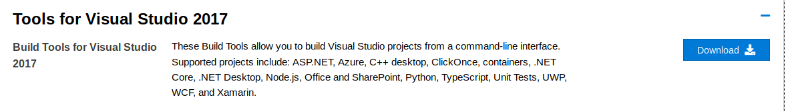

.. _getting_started:

Getting Started
===============

Make sure that you have Godot downloaded, you can download it here:
`Godot Download`_. The version that you will need will depend on whether or not
the project uses C# or not.

If you are using the C# version, you will also need to download and install
msbuild to compile the C# scripts contained within the game. Go to the
`Visual Studio download page`_, scroll down to 'All Downloads', then expand the
'Tools for Visual Studio 2017' section. Download and install the
'Build Tools for Visual Studio 2017.' You may need to restart your computer
after this so that it is fully added to your computer's PATH for Godot to find
it.

Alternatively, you could instead install Mono, which also includes msbuild.
Go here to download it: `Mono download`_. This is necessary if you are using
Mac or Linux.

.. _`Godot Download`: https://godotengine.org/download/
.. _`Visual Studio download page`: https://visualstudio.microsoft.com/downloads/
.. _`Mono download`: https://www.mono-project.com/download/stable/
