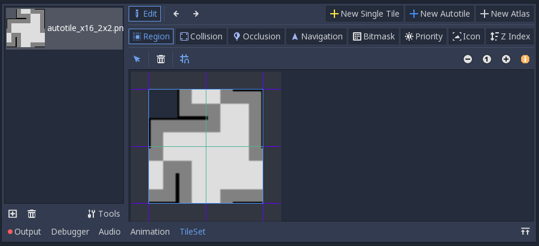
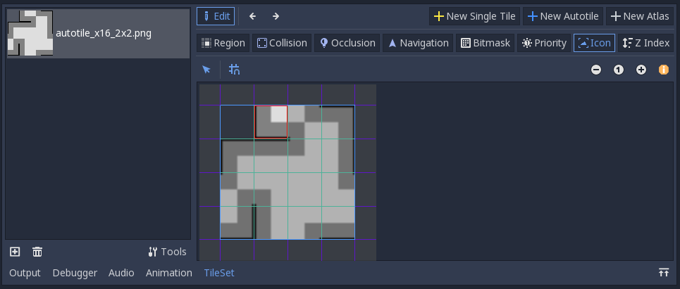
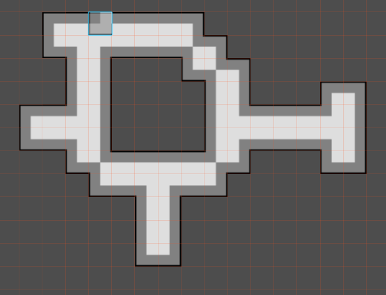

.. _autotiles:

Autotiles
=========

Sometimes, placing tiles correctly can be a long and tedious process.
Fortunately, Godot has a feature called autotiles that makes placing tiles
much easier. There's two 'types' of autotiles that you can use, 2x2 autotiles
and 3x3 autotiles.

    2x2 tileset

    3x3 tileset

In both of these tilesets, the outside of the tiles is lined with black, the
outer part of the tiles is dark gray, and the inner part of the tiles is light
gray.

Whichever type you use depends on your needs and how much effort you want to
put into your tileset. The downside of 2x2 tilesets is that you can not have
long, thin platforms; every solid wall must be at least two tiles wide. With
a 3x3 tileset, you can have 1 wide platforms. This will be explained visually
later.

Creating a 2x2 autotile
-----------------------

Create a tileset like you did before, except this time use a 2x2 autotile
graphic.

.. image:: 2x2-tileset-created.png

This time, click on the 'New Autotile' button on the top right, which is next
to the 'New single Tile' button that you used previously.

Make sure that the snap button is enabled, then select a region in the tileset
that represents the autotiles.

Depending on the size of your tiles, you may need to change the snap size and
subtile size of the tiles. The snap size only changes the snapping in the
tileset editor, while the subtile size is the size of each tile in the tileset.
Go ahead and change these if needed, and possibly also reselect the region if
the first region was not correct do to the snap size.

Go ahead and edit the collisions for all of the tiles.

Now, go to the 'Bitmask' tab.

.. image:: 2x2-bitmask-tab.png

This is where the tiles' connecting locations are set. Each tile has its own
2x2 grid of 'bits' that can either be 'set' or 'unset'. Click on a portion of a
tile to 'set' a bit, and Right-click on a bit to 'unset' it. These bits are the
portion of the tiles where they will connect to other tiles. In the tilesets
that I gave you, the light gray portions are where they will connect to other
tiles.

Go ahead and click on all of the light gray portions, and if you make a mistake,
right click on the area where the mistake was made. In the end, your bitmask
should look like this:

An autotile can have more tiles in it if you want, but this is the minimum
number of tiles that you need to have a complete 2x2 autotile. If you add more
tiles, just give them the proper bitmask.

Creating a 3x3 autotile
-----------------------

You can also create a 3x3 autotile. When you create the tileset, make sure that
the 'Autotile Bitmask Mode' is set to '3x3 (minimal)'.

Each tile in a 3x3 autotile has a 3x3 grid of bits instead of a 2x2 grid. This
is why a 3x3 autotile has so many more tiles in it. Again, the light gray areas
of the tileset that I provided is where the bitmask needs to be set.

Autotile Icon
-------------

By default, Godot places the editor icon for the tileset as the top-left tile.
In the 2x2 tileset that I provided, the top-left tile is completely transparent.
Go to the 'Icon' tab and click on any tile to set it as the editor icon for the
tileset.

Placing 2x2 autotiles
---------------------

When you go to place tiles for the 2x2 tileset in the editor, there will be
only one tile shown, even though your tileset actually has many more tiles.
Go ahead and select that tile.

When you place a single line of tiles, it probably won't look right. This is
because 2x2 autotiles can't be used with a single line of tiles.

Instead, make sure every wall is at least 2 tiles thick, and it should look
correct.

Placing 3x3 autotiles
---------------------

Unlike 2x2 autotiles, 3x3 autotiles can be arranged in any orientation.

