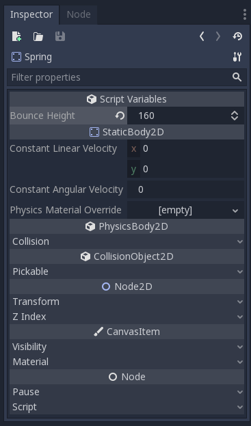

.. _objects:

Objects
=======

Levels will often times need more than just tiles to be a complete level. For
example, levels may have enemies, collectibles, NPCs, puzzles, etc. In Godot,
objects are represented by scenes, and can be placed in a level by instancing
them.

Finding Objects
---------------

Typically, projects will be organized so that objects can be easily located.
For example, a player object might be found in a folder named 'Objects/Player',
while a Bat enemy might be found in 'Objects/Enemies/Bat'. A level-specific
object could also be placed in something like 'Levels/Beach/Shell'. If you have
trouble finding what you need, don't be afraid to ask someone more familiar
with the project structure.

Here is an example of a project layout:

Notice that Menus are also organized into their own folders. Some programmers
might also have folders named 'Global' or 'Lib' for storing commonly used
scripts.

Creating Objects
----------------

For some cases, you may need to create your own objects. For example, if you
want to have a recurring background object such as a tree or a water fountain,
or something that the player can walk on like a bookshelf or a shipping crate,
it will probably be for the best to create a scene for it rather than recreate
the entire thing from scratch every time.

Here's an example of a tree:

And here's an example of a bookshelf, note how since it is a solid object, it
has a StaticBody2D root node, and it has a CollisionShape2D child:

Placing Objects
---------------

Now, you can just instance the objects using the instance button.

It might also be useful to align objects that you have instanced to a grid when
you move them. Click on the snap icon in the tool bar to enable snapping.

Then, click on the dropdown menu next to it, then click on 'Snap to Grid' to
enable snapping to grid. You may want to change the grid size of the snap by
clicking 'Configure Snap' in the drop down menu.

Now, you can place objects while snapped to the grid. If you want to see the
grid, press the G key to toggle the grid's visibility.

And here's the final product.

Configuring objects
-------------------

Programmers are able to give objects properties of their own. For example, a
'spring' object might have a 'Bounce Height' property that determines how high
the spring bounces the player when they jump on it.

Just change the custom 'Bounce Height' property under the 'Script Variables'
section like you would change any other property.

If you want to reset a property, just click the circular arrow icon that is
now next to the property.
