.. _tilemap:

Tilemaps
===============

Creating a Tilemap
------------------

The TileMap node is a useful node for designing 2d tile-based levels. There
are many different useful properties you can configure. You will probably need
to change the cell size depending on how big the tiles in your tileset is.

The Godot documentation has information on how to create Tilemaps, but some of
the information, especially the information concerning the creation of Tilesets,
is outdated. You can read it here: `Using Tilemaps`_.

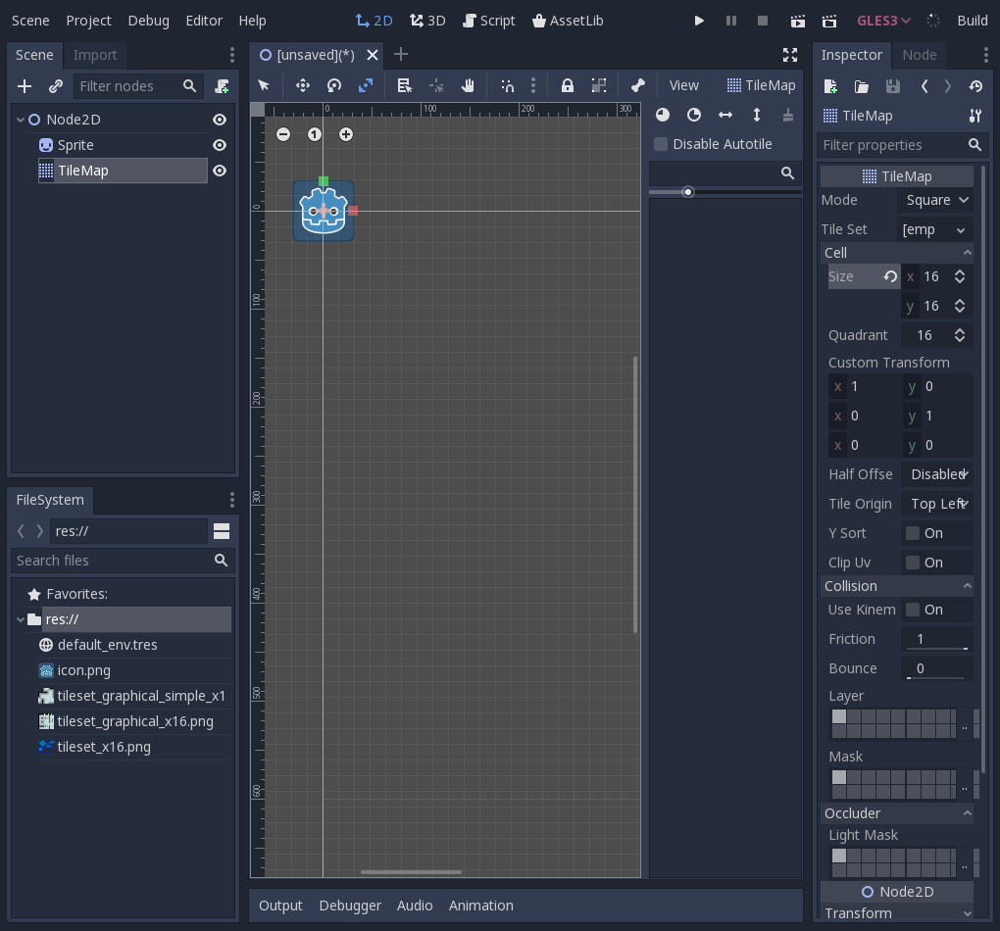

Creating a Tileset
------------------

Before you can use a Tilemap, you have to first create a Tileset for it to use.
Click on the 'Tile Set' property, then click 'New TileSet' to create a new
Tileset. If you have already created a TileSet, you can click 'Load' to load
a TileSet from a file.

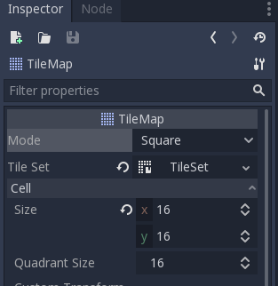

Once you have created a TileSet, you can then click on
'Tile Set' property again to open the TileSet.

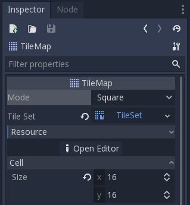

Now you can click on the 'Open Editor' button to open the TileSet editor.

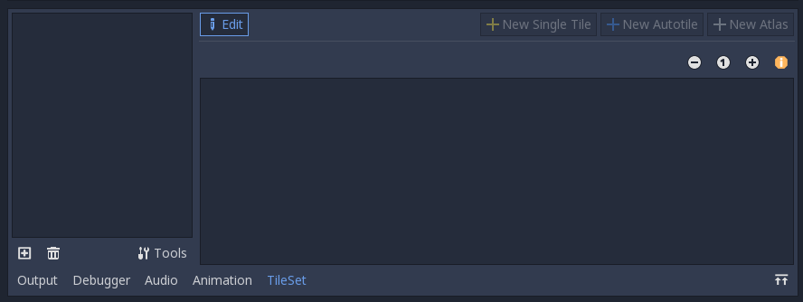

Click on the + icon on the bottom left to add an image to the TileSet. Godot
will prompt you to select an image.

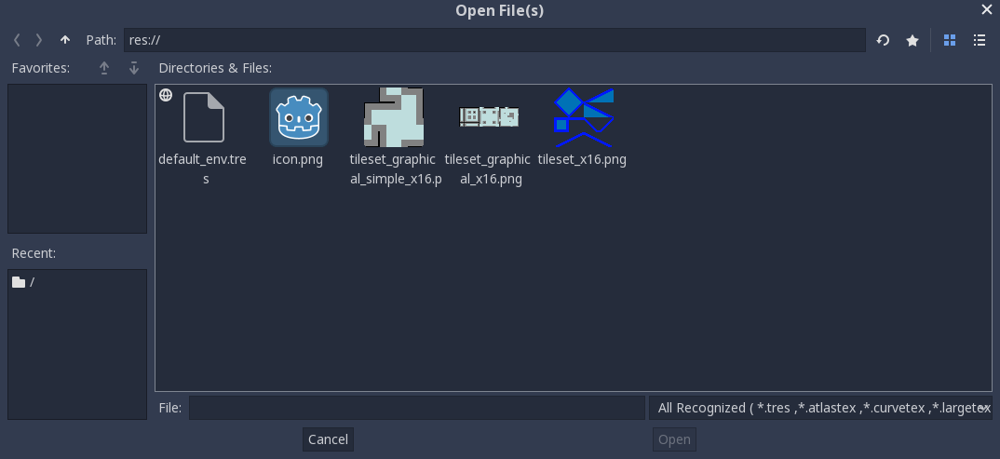

I have a sample tileset here. Go ahead and use it if you want. It's tiles are
16 pixels wide and 16 pixels tall.

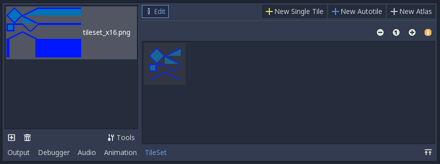

If the tiles are too small, you can click on the '+' icon on the upper right
to zoom in.

On the upper right, click on the button that says 'New Single Tile'. Click on
the grid snap icon, which looks like this:

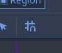

Click on a tile to set the region of the image that you want to graphically
represent your tile. If the grid doesn't match up with your tileset, don't
worry about it for now. Just go ahead and click anywhere. Then, on the
inspector pane, you will see a section called 'Snap Options'. Under these
options, configure the 'Step' property to be the size of your tiles.

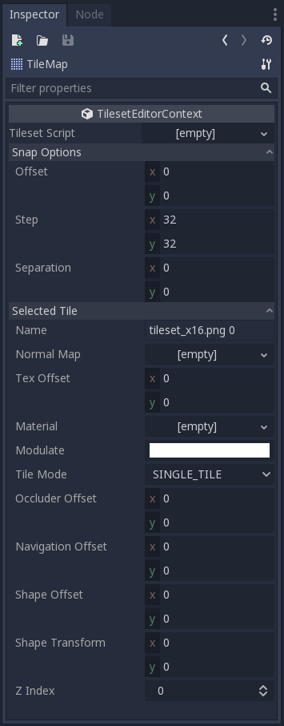

Once you set the step property, you can select the region again.

After you've created a tile, you can change its properties in the
'Selected Tile' options in the inspector pane on the right. It's a good habit
to change the tile's name to something more descriptive.

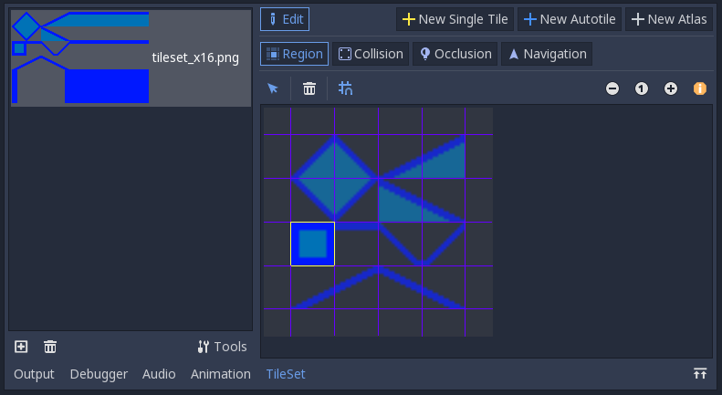

You can repeat this process for all of the tiles in your tileset by clicking the
'New Single Tile' button again.

Now each of your tiles has a region that corresponds to a section of the image.
However, if you put the tiles into the game, the player would just fall right
through them! So now, you need to give each of them a collision shape. Go to the
'Collision' tab to do this. Don't worry about the other tabs for now.

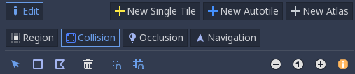

First, click on the tile that you want to give a collision to.
Then, click on the 'square' icon to create a rectangular collision
for that tile.
Finally, click on the tile to set its collision to a rectangle. Once you do
this, you can click and drag the orange dots on the corners of the tile to
change the collision, which is useful if the tile has an irregular shape.

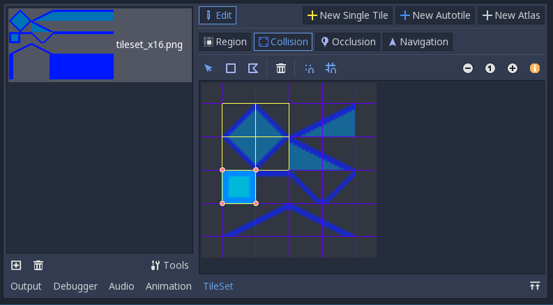

For the triangular corner tiles, click on the icon directly to the right of the
'square' icon, which has an irregular, flag-like shape. Then, click on the
three corners of the triangle to create the shape, and then click on the point
that you created first to finish.

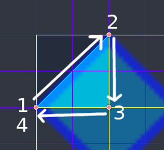

Finish the other four triangular tiles in the same way.

If you want to share this tileset between multiple levels instead of having to
create the same tileset over and over again, you will want to save the Tileset.
To do this, go to the inspector pane, and click on the 'TileMap' button to show
a list of all of the resources that the TileMap owns, then click on the Tileset
resource. This icon shows the resource or node that is currently being
edited.

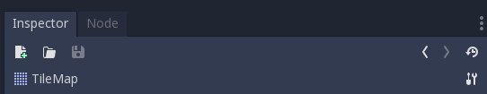

becomes

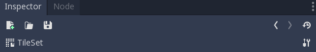

Then, click on the 'save' icon which is directly above it, then click 'Save'.
Choose a location to save it, be sure to give it a descriptive name (I prefer
to give it the same name as the image that was used to create it).

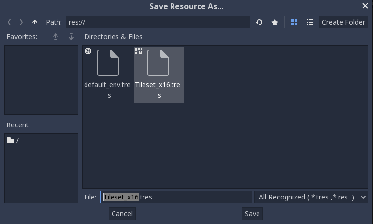

You are now ready to use the Tileset.

Editing a TileMap
-----------------

Select the TileMap node once again. You will now see all of the tiles that
belong to the tileset on the right. Go ahead and select a tile.

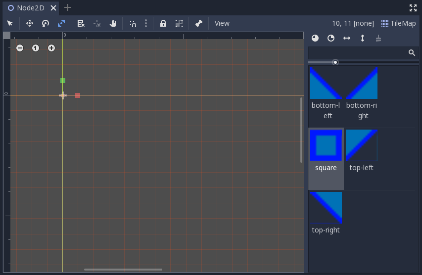

After you have
selected a tile, anywhere you click on in the editor will place a tile. Right
clicking on the editor will remove the tile at that location.

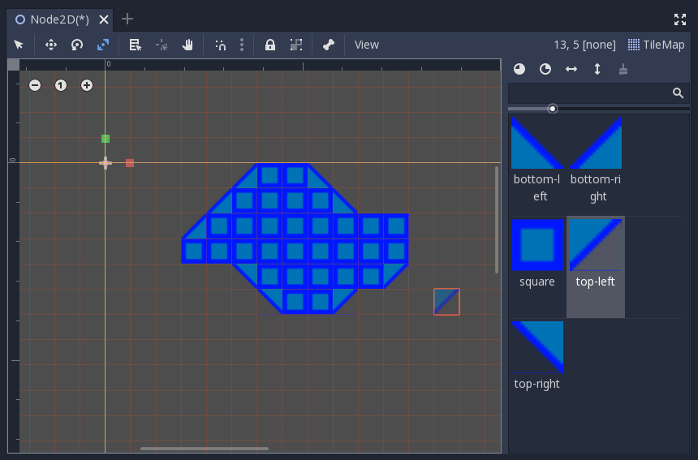

.. _`Using Tilemaps`: https://docs.godotengine.org/en/3.1/tutorials/2d/using_tilemaps.html
