.. _vaniamap:

Vaniamap
========

Basics of Vaniamap
~~~~~~~~~~~~~~~~~~

What is Vaniamap
----------------

Vaniamap is a Godot plugin that I created. It is world editor that allows for
levels to be easily arranged in a grid-like pattern. The levels themselves need
to be designed separately as their own scenes.

Opening the Vaniamap editor
---------------------------

The Vaniamap panel can be found on the bottom panel of the editor. By default,
this panel is set to display the game's output for debugging purposes.
Click on the 'Vania Designer' button on this panel to open the Vaniamap editor.

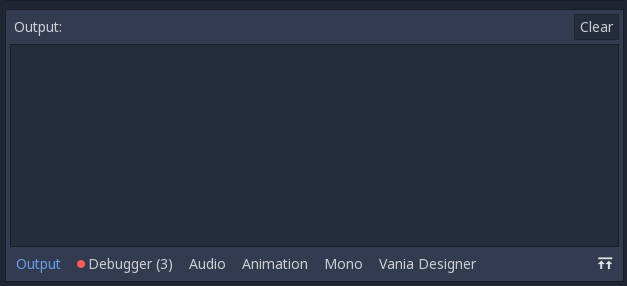

The Vaniamap interface
----------------------

When you open the Vaniamap editor panel, you will be greeted with an empty
interface with multiple buttons at the top.

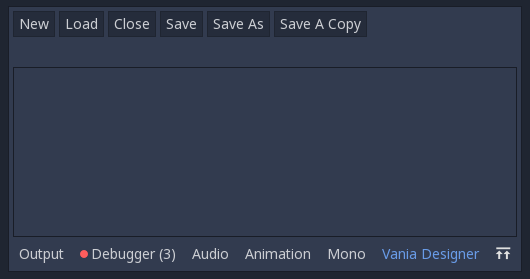

The buttons may seem familiar, since they are similar to buttons found in other
programs. There is a 'new' button for creating a new Vaniamap, a 'save' button
to save the Vaniamap, a 'close' button to close the currently opened Vaniamap,
a 'load' button to load a Vaniamap from a file, A 'save as' button to save a
Vaniamap as a different file, and a 'save a copy' button to save a Vaniamap as
a different file without changing the opened file's location (e.g. for saving
a backup).

You may also notice a double-arrow button on the bottom-right next to the
'Vaniamap Designer' button. Clicking this button will expand this panel. Click
it again to return to normal.

The .vmap File
--------------

Vaniamap opens and saves files as a .vmap file. The file itself is formatted
as a JSON file and can be edited as text; however, you will likely not have to
do  that, and doing so would be much more tedious than using the Vaniamap
interface.

Creating a Vaniamap
-------------------

Go ahead and create a new Vaniamap by clicking the 'new' button. Upon clicking
this button, you will be prompted to select a location to save the map. Go
ahead and pick somewhere to put it.

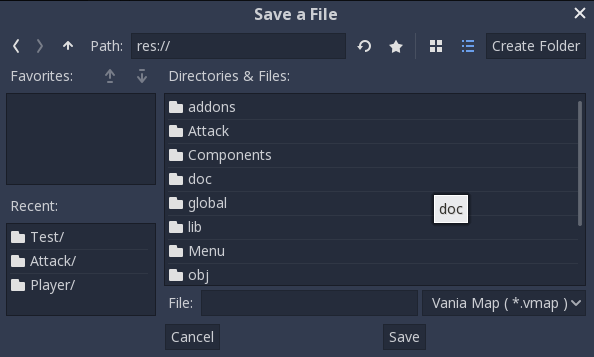

After you chose somewhere to save the map, the editor will now look like this:

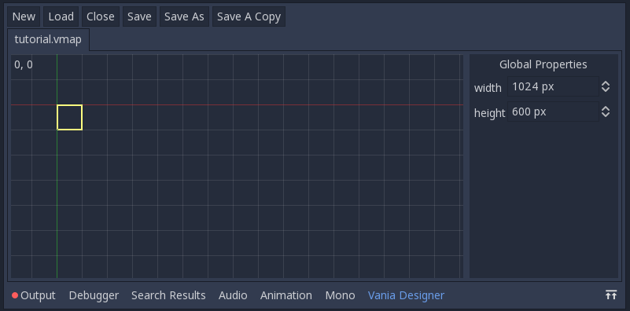

Notice that the grid is divided into multiple squares. You can configure the
in-game size of a single square in the global properties pane,
which can be found on the right side of the Vaniamap editor.
By default, a tile is 1024px wide and 600px tall, which
was chosen because that is the default Godot engine window size. You will most
likely want to change these. Be sure you know how big your levels are, since
every level needs to be a multiple of this size in order for Vaniamap
to work (e.g. with the default settings, you could have a 1024x600 level, a
2048x600 level, a 1024x1200 level, etc., more on this later).

At the upper-left corner of the grid, you will see two numbers separated by a
comma. This is the currently selected coordinate. If you left click on a different
square in the grid, the coordinate will change.

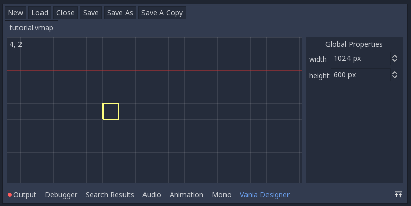

The red line represents the
x-axis and the green line represents the y-axis. By holding the middle mouse
button, you can pan the grid to look around. Use the mouse wheel to zoom in and
out. Right click to bring up the context menu, which provides multiple actions
you can perform on your current selection.

Creating Tiles
--------------

Right click on an empty square and click 'New Tile' to create a new tile in
that location. Upon doing so, you will be prompted to open a level scene file.

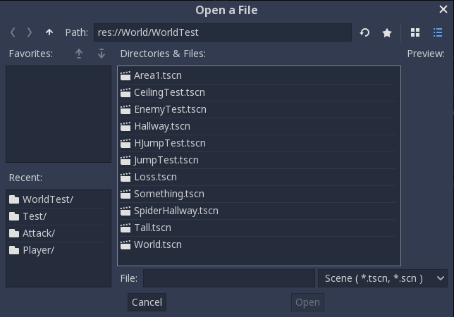

Go ahead and select a level file. Once you do that, a new tile will be created
at the location that you clicked. You will notice that the selection marker
now has a yellow X going through it, and there is also a 'Tile Properties' pane
above the 'Global Properties' pane on the right. It may be helpful to think of
a tile as a single 'room', and a Vaniamap as a house for all of these rooms.

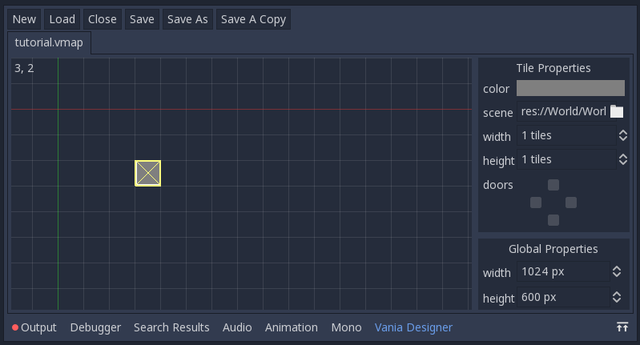

Go ahead and create several more tiles to represent the different levels that
you will be putting together.

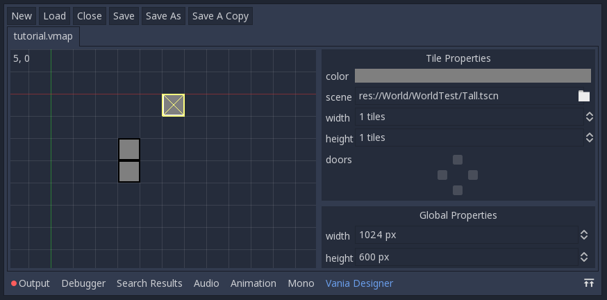

For convenience, you can open the scene that a tile points to in the scene
editor by right clicking and clicking the 'Open In Editor' button.

You can also delete all of the selected tiles by selecting multiple tiles and
pressing the 'delete' key, or by right clicking and clicking the 'Delete Tile'
button. Be sure to save frequently so that if you accidentally delete tiles
you didn't mean to, you won't lose any data.

Manipulating Tiles
------------------

By holding down left click on a tile and dragging it, you can move it around.
When you release left click, the tile will be placed where your mouse now is.
If the tile(s) can't be moved to that location, i.e. because there are other
tiles in the way, the tile(s) will be moved back to their original location.

By holding shift and clicking on tiles, you can select multiple tiles. With
multiple tiles selected, you can move them around as a group by clicking and
dragging any of the selected tiles. When you have multiple tiles selected, you
may notice that the 'Tile Properties' pane shows fewer properties. Selected
tiles will have a light border, while tiles that are not selected will have a
dark border. Since the cursor also has a light border, it also has a yellow X
through it to differentiate it from your other selections.

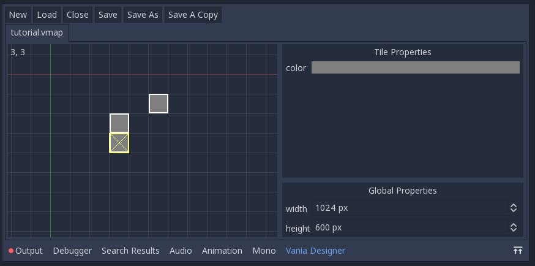

In the 'tile properties' pane, you can change the color of tiles. Just click on
the colored rectangle (gray by default) to bring up a color selector. This is
useful for visually grouping tiles together, or for marking points of interest.
Any new tiles that you create will take on the same color as the last tile you
selected. You can also change the scene that this tile points to by clicking
on the file icon that is next to the scene property.

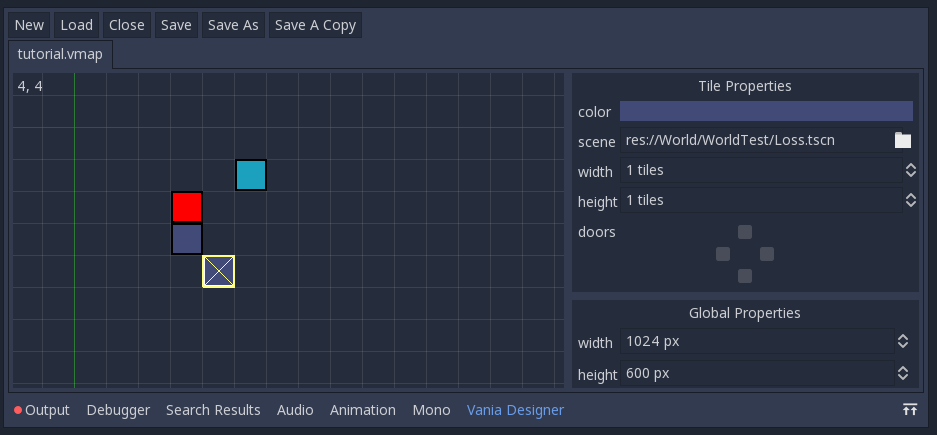

Another important feature of Vaniamap is that a tile can have any whole number
width or height between 1 and 255. The actual level scene for the tile should
have a width that is the tile's width multiplied by width that was set in the
global properties, and likewise a height that is the tile's height multiplied
by the height that was set in the global properties. For example, if a tile's
width is 4 and its height is 3, and in the global properties the tile size is
1024px x 600px, then the actual level's size should be 4096px x 1800px.

You can set the tile's width and height in the 'tile properties' pane on the
right. If you input a width or height that is too big for the tile to fit (i.e.
there is another tile in the way or you input a number greater than 255), then
the size will only increase to as big as the tile can actually grow.

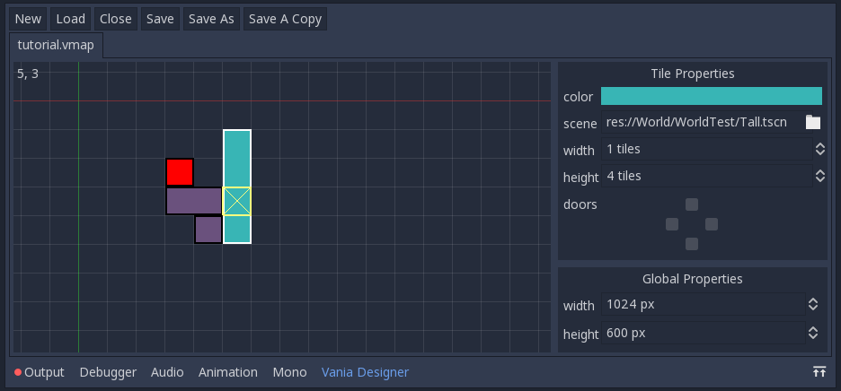

Doors
~~~~~

What are doors
--------------

In order to connect tiles together, Vaniamap also has a concept known as doors.
Doors connect two grid squares together, they do not act on tiles as a whole.
It's important to remember that two squares within the same tile can have
different door configurations.
Another thing to note is that even though you can connect any two tiles
together with doors, it is up to the level designer to actually create pathways
that the player can take to other rooms, as Vaniamap makes no changes to the
actual levels.

Placing doors
-------------

When you have a room selected, you may notice that under the 'Tile Properties'
pane is a 'doors' property with four checkboxes arranged in a diamond pattern.

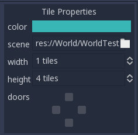

The topmost box represents the northern door, the right box represents the
eastern door, the bottom box represents the southern door, and the left box
represents the left door. Click on these boxes to set or unset that door.

Once you have set doors, the Vaniamap interface will show white squares where
doors are to show that these rooms are connected.

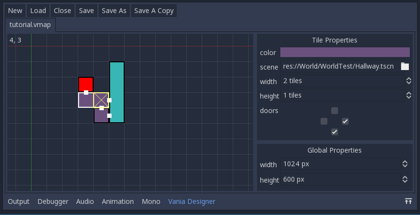

.vmap Format
~~~~~~~~~~~~

The .vmap files are JSON formatted with the root being an object.
The root object has a 'version' property which gives the .vmap format version
(1.0 as of writing this document). The 'width' property is the width, in pixels,
of each tile. The 'height' property is the height, in pixels, of each tile.
The 'tiles' tag is a list of tiles. The 'doors' tag is a list of doors.

Tiles
-----

Each tile is an object. The 'x' property is the top-left x coordinate of the
tile. The 'y' property is the top-left y coordinate of the tile. The 'width'
property is the width, in squares, of the tile. The 'height' property is the
height, in squares, of the tile. The 'color' property is the hexadecimal
ARGB color representation of the tile's color. The 'path' property is the path
to the scene that the tile points to.

Doors
-----

Each door is an object. The 'x' property is the top-left x coordinate of the
door. The 'y' property is the top-left y coordinate of the door. The 'right'
property determines at the square at the given x,y coordinate connects to the
square directly to its right. The 'down' property determines if the square at
the given x,y coordinate connects to the square directly below it. Note that
there is no left or top property; this is due to the fact that if a square
connects to a square above it, then the square above it will also connect to
the square below itself, thus that information is redundant and unnecessary.
